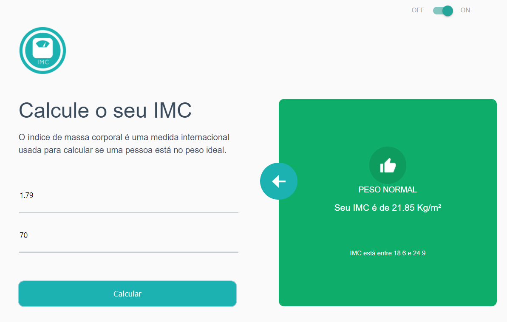

<h1 align="center">Calculadora IMC</h1>

<p align="center">
  <a href="#dart-sobre">Sobre</a> &#xa0; | &#xa0;
  <a href="#rocket-tecnologias">Tecnologias</a> &#xa0; | &#xa0;
  <a href="#white_check_mark-requisitos">Requisitos</a> &#xa0; | &#xa0;
  <a href="#checkered_flag-iniciando">Iniciando</a> &#xa0; | &#xa0;
  <a href="https://github.com/rapharodrigues04" target="_blank">Author</a>
</p>

<br>

## :dart: Sobre

Calculadora IMC




## :rocket: Tecnologias

Tecnologias usadas:

- [React](https://pt-br.reactjs.org/)
- [TypeScript](https://www.typescriptlang.org/)
- [Materialized CSS](https://materializecss.com/)

## :white_check_mark: Requisitos

Para iniciar o 🏁, você precisa ter o [Git](https://git-scm.com) e o [Node](https://nodejs.org/en/) instalados.

## :checkered_flag: Iniciando

```bash
# Clone this project
$ https://github.com/rapharodrigues04/calculaIMC-react

# Acesso
$ cd calc-imc

# Instale as dependências
$ npm install

# Rode o projeto
$ npm start

# O servidor iniciará em <http://localhost:3000>
```

Feito por <a href="https://github.com/rapharodrigues04" target="_blank">Raphael Rodrigues</a>
